# What is Strata?

**Strata** is a revolutionary MCP server that handles thousands of tools progressively, solving the three major problems that plague AI agents today:

- **🤯 Tool Overload**: Too many tools cause AI "choice paralysis"
- **💥 Context Overload**: Long tool lists blow up token counts and costs  
- **📉 Coverage Gap**: Most servers are stuck at <40~50 tools, limiting what you can build

Instead of overwhelming AI agents with hundreds of tools at once, Strata guides them through a logical, step-by-step discovery process—just like how humans would approach finding the right tool.

<Frame>
  
</Frame>

## Why Use Strata?

<CardGroup cols={2}>
  <Card title="Progressive Tool Discovery" icon="route">
    Guides AI agents step-by-step instead of overwhelming them with hundreds of tools at once
  </Card>
  <Card title="Massive Tool Coverage" icon="toolbox">
    Access thousands of granular features across 100+ integrations through one endpoint
  </Card>
  <Card title="Superior Performance" icon="gauge-high">
    +14.1% higher pass@1 rate vs official GitHub server, 83%+ accuracy on complex workflows
  </Card>
  <Card title="Cost Efficient" icon="dollar-sign">
    Dramatically reduces token consumption by showing only relevant tools when needed
  </Card>
</CardGroup>

## How Strata Works

Strata works like a smart guide that helps AI agents think like humans. Instead of showing all tools at once, it guides agents through a logical discovery process:

**Example**: *"Find my stale pull requests in our main repo"*

```mermaid
graph TD
    A[AI Query: Find stale PRs] --> B[1️⃣ Intent → Integration]
    B --> C[Strata identifies: GitHub needed]
    C --> D[2️⃣ Integration → Categories]
    D --> E[Shows: Repos, Issues, PRs, Actions]
    E --> F[3️⃣ Category → Actions]
    F --> G[AI selects PRs → Shows PR actions]
    G --> H[4️⃣ Action → Execute]
    H --> I[AI picks list_pull_requests → Executes with params]
```



This progressive approach unlocks **massive depth**—while most integrations offer 40-50 high-level tools, Strata exposes hundreds of granular features per app without overwhelming the AI.

## Getting Started with Strata

Create your first Strata server in minutes:

<CodeGroup>
```python Python SDK
from klavis import Klavis

klavis = Klavis(api_key="your-api-key")

# Create Strata with specific servers
strata = klavis.strata.create(
    user_id="user123",
    servers=["GMAIL", "SLACK", "NOTION", "GITHUB"]
)

print(f"Strata URL: {strata.strata_server_url}")
```

```typescript TypeScript SDK
import { Klavis } from 'klavis';

const klavis = new Klavis.Client({ apiKey: 'your-api-key' });

// Create Strata with all available servers
const strata = await klavis.strata.create({
    userId: 'user123',
    servers: 'ALL'  // 100+ Klavis MCP servers
});
```

```bash REST API
curl -X POST "https://api.klavis.ai/mcp-server/strata/create" \
  -H "Authorization: Bearer your-api-key" \
  -H "Content-Type: application/json" \
  -d '{"userId": "user123", "servers": ["GMAIL", "SLACK", "NOTION"]}'
```
</CodeGroup>

## Performance & Results

Strata delivers measurably better results than traditional MCP servers:

<CardGroup cols={3}>
  <Card title="+14.1% vs GitHub" icon="github">
    Higher pass@1 rate vs official GitHub MCP server
  </Card>
  <Card title="+10.1% vs Notion" icon="notion">
    Higher pass@1 rate vs official Notion MCP server  
  </Card>
  <Card title="83%+ Accuracy" icon="target">
    On complex, real-world multi-app workflows
  </Card>
</CardGroup>

## Managing Your Strata

<CodeGroup>
```python Add Servers
# Add more servers to existing Strata
klavis.strata.add(
    strata_id="strata_abc123",
    servers=["AIRTABLE", "SALESFORCE"]
)
```

```python Get Info
# Get Strata information and auth URLs
strata_info = klavis.strata.get(strata_id="strata_abc123")
print(f"Auth URLs: {strata_info.auth_urls}")
```
</CodeGroup>

## Configuration Options

<CardGroup cols={2}>
  <Card title="Specific Servers" icon="list">
    Choose exactly which integrations you need
    ```python
    servers=["GMAIL", "SLACK", "NOTION", "GITHUB"]
    ```
  </Card>
  <Card title="All Available Servers" icon="globe">
    Get access to 100+ Klavis MCP servers
    ```python
    servers="ALL"
    ```
  </Card>
  <Card title="External MCP Servers" icon="plug">
    Connect your own MCP servers alongside Klavis
    ```python
    external_servers=[{"name": "crm", "url": "..."}]
    ```
  </Card>
  <Card title="Auto Authentication" icon="key">
    OAuth flows handled automatically with unified token management
  </Card>
</CardGroup>

## Integration Examples

<CardGroup cols={2}>
  <Card title="Claude Desktop" icon="desktop">
    Add Strata to Claude Desktop configuration
    ```json
    "klavis-strata": {
      "command": "npx",
      "args": ["@modelcontextprotocol/server-everything", "your-strata-url"]
    }
    ```
  </Card>
  <Card title="CrewAI" icon="users">
    Use Strata tools in your AI agents
    ```python
    from crewai_tools import MCPServerAdapter
    adapter = MCPServerAdapter(server_url="your-strata-url")
    agent = Agent(tools=adapter.get_tools())
    ```
  </Card>
  <Card title="OpenAI Functions" icon="openai">
    Convert Strata tools to OpenAI function format
    ```python
    tools = klavis.mcp_server.list_tools(
        server_url=strata.strata_server_url, 
        format="OPENAI"
    )
    ```
  </Card>
  <Card title="One-Click Setup" icon="mouse-pointer">
    Add Strata to Cursor, VS Code, or any MCP app with one click at [klavis.ai](https://klavis.ai)
  </Card>
</CardGroup>

## Use Case Examples

<CardGroup cols={3}>
  <Card title="Marketing Automation" icon="megaphone">
    **Perfect for**: Email campaigns, social media, lead management
    ```python
    servers=["GMAIL", "HUBSPOT", "MAILCHIMP", "LINKEDIN"]
    ```
  </Card>
  <Card title="Development Workflow" icon="code">
    **Perfect for**: Code reviews, project management, documentation
    ```python
    servers=["GITHUB", "LINEAR", "NOTION", "SLACK"]
    ```
  </Card>
  <Card title="Sales Operations" icon="chart-line-up">
    **Perfect for**: CRM management, deal tracking, communication
    ```python
    servers=["SALESFORCE", "HUBSPOT", "GMAIL", "CLOSE"]
    ```
  </Card>
</CardGroup>

## Watch Strata in Action

See how Strata navigates complex multi-app workflows automatically:

<Card title="Demo Video" icon="play" href="https://youtu.be/N00cY9Ov_fM">
  Watch Strata handle complex workflows with multiple apps
</Card>

Ready to experience progressive tool discovery? Create your first Strata server and see the difference!

<CardGroup cols={2}>
  <Card title="Get Started" icon="rocket" href="/documentation/quickstart">
    Create your first Strata server in minutes
  </Card>
  <Card title="API Reference" icon="book" href="/api-reference/strata/create">
    Explore the complete Strata API
  </Card>
</CardGroup>
