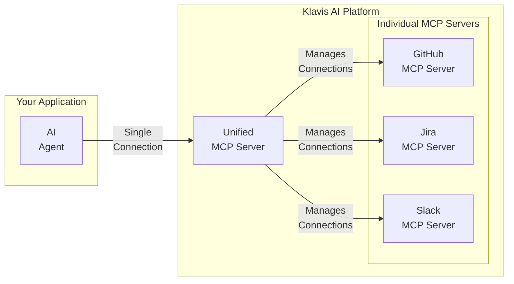

import { Steps, Step } from 'nextra/components'
import { CodeGroup } from 'nextra/components'
import { Frame } from 'nextra/components'
import { Note, Tip, Check } from 'nextra/components'

## Overview

The Klavis Unified MCP (Model-Context Protocol) Server provides a single, consolidated endpoint to interact with multiple MCP servers simultaneously. Instead of managing connections to each MCP server (like GitHub, Jira, or Slack) individually, you can connect to the Unified MCP Server and access all their tools through one interface.

This simplifies your application's architecture, reduces complexity, and makes it easier to build powerful AI agents that can leverage a wide range of tools from different services.



## Prerequisites

- You need a Klavis API key. If you don't have one, you can create one [here](https://www.klavis.ai/home/api-keys).

## How It Works

The process involves two main stages:

1.  **Create Individual MCP Server Instances**: For each user of your application, you first create separate MCP server instances for each third-party service they need to connect to (e.g., a GitHub server and a Jira server). Each of these servers requires its own authentication via OAuth.

2.  **Create a Unified MCP Server Instance**: Once the individual servers are created and authenticated, you create a Unified MCP Server instance for that same user. The Unified Server automatically discovers and connects to all individual MCP servers associated with the user's ID.

Your AI application then connects to this single Unified MCP Server endpoint to access tools from all the underlying services.

## Implementation

Follow the steps below to set up and use the Unified MCP Server.

<Steps>
<Step title="1. Create Individual MCP Server Instances">
Before you can create a unified server, you must first create individual MCP server instances for a specific user. It's crucial that you use the same `user_id` for all servers that you want to group under one unified server.

Here’s how you can create a GitHub and a Jira MCP server instance for the same user.

#### Request
<CodeGroup>
```python Python
from klavis import Klavis
from klavis.types import McpServerName

klavis_client = Klavis(api_key="<YOUR_API_KEY>")

# Create a GitHub MCP server instance
github_server = klavis_client.mcp_server.create_server_instance(
    server_name=McpServerName.GITHUB,
    user_id="<YOUR_USER_ID>"
)

# Create a Jira MCP server instance
jira_server = klavis_client.mcp_server.create_server_instance(
    server_name=McpServerName.JIRA,
    user_id="<YOUR_USER_ID>", # Same user_id
)

print("GitHub Server:", github_server)
print("Jira Server:", jira_server)
```

```javascript TypeScript
import { KlavisClient, Klavis } from 'klavis';

const klavisClient = new KlavisClient({ apiKey: '<YOUR_API_KEY>' });

// Create a GitHub MCP server instance
const githubServer = await klavisClient.mcpServer.createServerInstance({
    serverName: Klavis.McpServerName.Github,
    userId: "<YOUR_USER_ID>"
});

// Create a Jira MCP server instance
const jiraServer = await klavisClient.mcpServer.createServerInstance({
    serverName: Klavis.McpServerName.Jira,
    userId: "<YOUR_USER_ID>", // Same userId
});

console.log('GitHub Server:', githubServer);
console.log('Jira Server:', jiraServer);
```

```bash cURL
# Create a GitHub MCP server instance
curl --request POST \
  --url https://api.klavis.ai/mcp-server/instance/create \
  --header 'Authorization: Bearer <YOUR_API_KEY>' \
  --header 'Content-Type: application/json' \
  --data '{
  "serverName": "GitHub",
  "userId": "<YOUR_USER_ID>"
}'

# Create a Jira MCP server instance
curl --request POST \
  --url https://api.klavis.ai/mcp-server/instance/create \
  --header 'Authorization: Bearer <YOUR_API_KEY>' \
  --header 'Content-Type: application/json' \
  --data '{
  "serverName": "Jira",
  "userId": "<YOUR_USER_ID>"
}'
```

```go Go
package main

import (
	"fmt"
	"strings"
	"net/http"
	"io/ioutil"
)

func main() {
	url := "https://api.klavis.ai/mcp-server/instance/create"

	// Create a GitHub MCP server instance
	githubPayload := strings.NewReader("{\n  \"serverName\": \"GitHub\",\n  \"userId\": \"<YOUR_USER_ID>\"\n}")

	req, _ := http.NewRequest("POST", url, githubPayload)
	req.Header.Add("Authorization", "Bearer <YOUR_API_KEY>")
	req.Header.Add("Content-Type", "application/json")

	res, _ := http.DefaultClient.Do(req)
	defer res.Body.Close()
	body, _ := ioutil.ReadAll(res.Body)

	fmt.Println("GitHub Server Response:")
	fmt.Println(string(body))

	// Create a Jira MCP server instance
	jiraPayload := strings.NewReader("{\n  \"serverName\": \"Jira\",\n  \"userId\": \"<YOUR_USER_ID>\"\n}")

	req2, _ := http.NewRequest("POST", url, jiraPayload)
	req2.Header.Add("Authorization", "Bearer <YOUR_API_KEY>")
	req2.Header.Add("Content-Type", "application/json")

	res2, _ := http.DefaultClient.Do(req2)
	defer res2.Body.Close()
	body2, _ := ioutil.ReadAll(res2.Body)

	fmt.Println("Jira Server Response:")
	fmt.Println(string(body2))
}
```

```java Java
// Create a GitHub MCP server instance
HttpResponse<String> githubResponse = Unirest.post("https://api.klavis.ai/mcp-server/instance/create")
  .header("Authorization", "Bearer <YOUR_API_KEY>")
  .header("Content-Type", "application/json")
  .body("{\n  \"serverName\": \"GitHub\",\n  \"userId\": \"<YOUR_USER_ID>\"\n}")
  .asString();

System.out.println("GitHub Server Response: " + githubResponse.getBody());

// Create a Jira MCP server instance
HttpResponse<String> jiraResponse = Unirest.post("https://api.klavis.ai/mcp-server/instance/create")
  .header("Authorization", "Bearer <YOUR_API_KEY>")
  .header("Content-Type", "application/json")
  .body("{\n  \"serverName\": \"Jira\",\n  \"userId\": \"<YOUR_USER_ID>\"\n}")
  .asString();

System.out.println("Jira Server Response: " + jiraResponse.getBody());
```
</CodeGroup>

#### Response
Each call will return a `serverUrl`, `instanceId`, and an `oauthUrl`.

<CodeGroup>
```json GitHub Server Response
{
  "serverUrl": "https://github-mcp-server.klavis.ai/mcp/?instance_id=<github-instance-id>",
  "instanceId": "<github-instance-id>",
  "oauthUrl": "https://api.klavis.ai/oauth/github/authorize?instance_id=<github-instance-id>"
}
```
```json Jira Server Response
{
  "serverUrl": "https://jira-mcp-server.klavis.ai/mcp/?instance_id=<jira-instance-id>",
  "instanceId": "<jira-instance-id>",
  "oauthUrl": "https://api.klavis.ai/oauth/jira/authorize?instance_id=<jira-instance-id>"
}
```
</CodeGroup>

<Check>
You must guide your user through the `oauthUrl` for each server to grant access. The Unified MCP Server will only connect to authenticated individual servers. Refer to our [OAuth documentation](/documentation/klavis-oauth-white-label) for more details.
</Check>

</Step>

<Step title="2. Create a Unified MCP Server Instance">
Once the individual MCP servers are created and authorized, you can create a Unified MCP Server instance. You only need to provide the `user_id` that you used in the previous step.

#### Request
<CodeGroup>
```python Python
from klavis import Klavis

klavis_client = Klavis(api_key="<YOUR_API_KEY>")

# Create a Unified MCP server instance
unified_server = klavis_client.mcp_server.create_unified_mcp_server_instance(
    user_id="<YOUR_USER_ID>"
)

print(unified_server)
```

```javascript TypeScript
import { KlavisClient } from 'klavis';

const klavisClient = new KlavisClient({ apiKey: '<YOUR_API_KEY>' });

// Create a Unified MCP server instance
const unifiedServer = await klavisClient.mcpServer.createUnifiedMcpServerInstance({
    userId: "<YOUR_USER_ID>"
});

console.log(unifiedServer);
```

```bash cURL
curl --request POST \
  --url https://api.klavis.ai/mcp-server/unified/instance/create \
  --header 'Authorization: Bearer <YOUR_API_KEY>' \
  --header 'Content-Type: application/json' \
  --data '{
  "userId": "<YOUR_USER_ID>"
}'
```

```go Go
package main

import (
	"fmt"
	"strings"
	"net/http"
	"io/ioutil"
)

func main() {
	url := "https://api.klavis.ai/mcp-server/unified/instance/create"

	payload := strings.NewReader("{\n  \"userId\": \"<YOUR_USER_ID>\"\n}")

	req, _ := http.NewRequest("POST", url, payload)

	req.Header.Add("Authorization", "Bearer <YOUR_API_KEY>")
	req.Header.Add("Content-Type", "application/json")

	res, _ := http.DefaultClient.Do(req)

	defer res.Body.Close()
	body, _ := ioutil.ReadAll(res.Body)

	fmt.Println(res)
	fmt.Println(string(body))
}
```

```java Java
HttpResponse<String> response = Unirest.post("https://api.klavis.ai/mcp-server/unified/instance/create")
  .header("Authorization", "Bearer <YOUR_API_KEY>")
  .header("Content-Type", "application/json")
  .body("{\n  \"userId\": \"<YOUR_USER_ID>\"\n}")
  .asString();
```
</CodeGroup>

#### Response
The response will contain the `serverUrl` for the Unified MCP Server.

```json Response
{
  "serverUrl": "https://unified-mcp-server.klavis.ai/mcp/?instance_id=<unified-instance-id>",
  "instanceId": "<unified-instance-id>"
}
```

<Note>
The `serverUrl` is the single endpoint you'll use for your AI application to connect to all of the user's underlying MCP servers.
</Note>
</Step>

<Step title="3. Use the Unified MCP Server">
Connect your AI application or MCP client to the `serverUrl` obtained in the previous step. You can now access tools from all connected MCP servers (e.g., GitHub and Jira) through this single connection.

You can discover all available tools by calling the `list_tools` endpoint on the Unified MCP Server. For more details, see the [API reference for listing tools](https://docs.klavis.ai/api-reference/mcp-server/list-tools).

<Tip>
When a new individual MCP server is created and authenticated for a user, it will be automatically included in their Unified MCP Server without needing to recreate it.
</Tip>

</Step>
</Steps>
